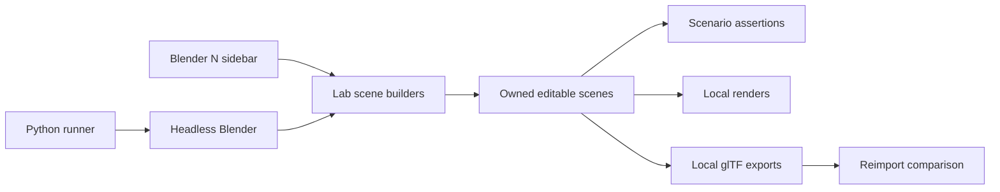

# Architecture

## Repository roles

`blender_lab/` contains the Blender add-on and scene builders. `scripts/` contains host orchestration, packaging, and validation. `catalog.json` identifies documented experiments. `docs/` holds the product, mechanism, acceptance, research, and evidence summaries. Generated builds remain in ignored local output directories.

## Data ownership

Each builder uses a stable ID and owned scene/data naming. Open experiment creates a separate scene. Apply changes its mechanism in place; Reset confirms before replacing only the active owned scene. Keep manually authored work in a saved copy; do not use global delete, orphan purge, or factory-reset behavior inside an add-on operator. Blender datablocks can be shared between scenes, so ownership must be checked before deletion.

## Execution

The host runner invokes the selected Blender executable with background execution and the repository's source. Errors must propagate to a failing exit/receipt. A `.blend` save is a useful output artifact, while source remains authoritative. Tests inspect both authored structure and evaluated behavior where relevant.

## Rendering and export

The initial CLI preview uses Cycles CPU, 16 samples, and 800 x 600 PNG output with the Standard view transform. Material nodes, color spaces, camera, and lighting affect the preview; record them with evidence instead of claiming a renderer-independent match. glTF carries a bounded subset of Blender data. BL-006 uses supported image/color material wiring for interchange; arbitrary shader graphs, procedural node graphs, and Blender modifier editing do not survive as editable source mechanisms in glTF.
