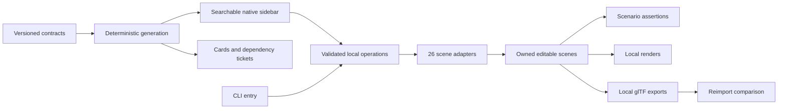

# Architecture

## Repository roles

`specs/experiments.json` defines the atlas. The generator validates identities/dependency DAG and emits catalog, cards, matrix, milestones and tickets. The source-only ZIP embeds that catalog. `catalog.py` filters metadata without importing proposed adapters. `blender_lab/` contains the native host, shared local operations and 26 scene adapters; `scripts/` contains orchestration and qualification. Outputs remain ignored.

## Data ownership

Each generated scene has a stable lab ID and unique instance ID. Builders snapshot created datablocks and retain an ownership list. Open creates a separate scene; Apply changes it in place. Confirmed Reset replaces the active owned scene and removes only unused owned dependencies to a fixed point, including actions, node groups, materials and images. Shared users survive. No global orphan purge or deletion-by-prefix. Save a separate file when preserving manual changes.

`operations.py` provides immutable Open/Apply/Reset requests, finite input validation, instance scope and receipts. A process-local cache retains 128 completed request IDs: identical retries return the previous receipt; conflicting payloads fail. This is bounded local retry protection, not durable storage or transactional rollback. Fresh Open requests intentionally create separate scenes.

## Execution

The host runner invokes the selected Blender executable with background execution and the repository's source. Errors must propagate to a failing exit/receipt. A `.blend` save is a useful output artifact, while source remains authoritative. Tests inspect both authored structure and evaluated behavior where relevant.

The runner disables automatic execution and supplies Python failure propagation. `labs.py` owns baseline setup and six foundation mechanisms; `authoring.py` adds the modular kit, shader comparison and atmosphere cards. Sidebar/CLI share operations/builders. Cappy invokes the CLI through a loopback adapter and stores hashed recipes; arbitrary native editing is not recorded.

## Planned infrastructure

Core tickets cover capability probing, richer operations, manifests, isolated jobs, staged publication, owned caches/recovery, editor adapters, format comparison, visible capture, diagnostics, packaging and evidence indexing. These are contracts/dependencies, not implemented services. No network endpoint or connected MCP server is exposed.

Long tasks will validate versioned specs, use bounded workers/owned scratch, transition through queued/running/validating/publishing to terminal status and publish only after checks. Cancellation stops the owned process and closes streams. Cache identity includes recipe/source/runtime/profile. Durable receipts/checkpoints must survive a fresh process before those tickets close.

## Repository boundary

Internal missions consume an exact public Git pin. Public source never imports private defaults/files/host paths/skills. Generated scenes, media, caches, raw receipts and ZIPs remain ignored; sanitized summaries identify actual gates.

## Rendering and export

The initial CLI preview uses Cycles CPU, 16 samples, and 800 x 600 PNG output with the Standard view transform. Material nodes, color spaces, camera, and lighting affect the preview; record them with evidence instead of claiming a renderer-independent match. glTF carries a bounded subset of Blender data. BL-006 uses supported image/color material wiring for interchange; arbitrary shader graphs, procedural node graphs, and Blender modifier editing do not survive as editable source mechanisms in glTF.
